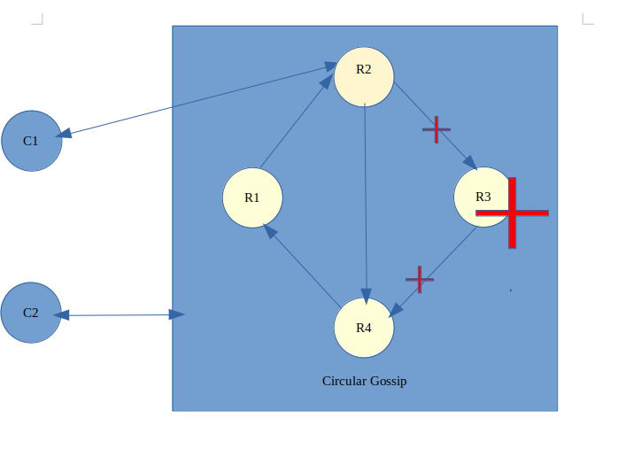

# Relatório do projeto Sauron

Sistemas Distribuídos 2019-2020, segundo semestre

## Autores
 
**Grupo A45**

| Number | Name              | User                                | Email                                        |
| -------|-------------------|-------------------------------------| ---------------------------------------------|
| 80894  | Basanta Poudel    | <https://github.com/BasantaPoudel>  | <mailto:basanta.poudel@tecnico.ulisboa.pt>   |
| 83500  | Luis Ferreira     | <https://github.com/lp24>           | <mailto:luis.pedro.f@tecnico.ulisboa.pt>     |
| 86477  | Maria Lopes      | <https://github.com/MargaridaLopes>  |<mailto:maria.margarida.espanhol.lopes@tecnico.ulisboa.pt>         |

  

## Melhorias da primeira parte

Os testes foram corrigidas incluindo anotações correctas onde for necessários.
Os nomes das classes foram alterados para serem diferentes do nomes dos classes de GRPC.
As algumas propriedades de cameras foram alteradas para suportar o segundo parte de projecto.

https://github.com/tecnico-distsys/A45-Sauron/commit/3273fed3b3b4abb4d83221184834dc31c1ca116d

## Modelo de faltas

Faltas Toleradas:
-Faltas silenciosas nas réplicas

Faltas Não Toleradas:
-Faltas no Zookeeper
-Todas as réplicas falharem ao mesmo tempo
-Faltas bizantinas.

## Solução

As réplicas fazem ‘gossip’ em ‘círculo’, em que por exemplo no caso de haver 4 réplicas, a 1 informa a 2, a 2->3, 3->4 e 4->1. Se  for exemplo a réplica 3 estiver em baixo, o gossip é feito 1->2, 2->4, 4->1.

## Protocolo de replicação

Cada réplica guarda o log de todos os updates de todas as réplicas (que essa réplica aplicou) e um timestamp vetorial que indica os updates aplicados (no fundo guarda o tamanho de cada lista do log).
Quando cada réplica pede a outra updates, envia o seu timestamp vetorial e a outra réplica devolve a parte do seu log correspondente aos updates que a outra não tem.

## Opções de implementação

_(Descrição de opções de implementação, incluindo otimizações e melhorias introduzidas)_

## Notas finais

_(Algo mais a dizer?)_

